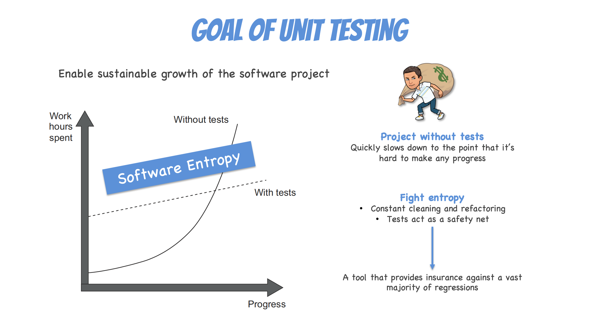
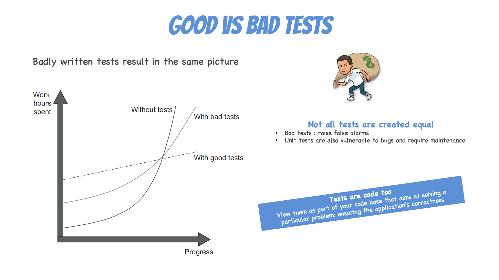
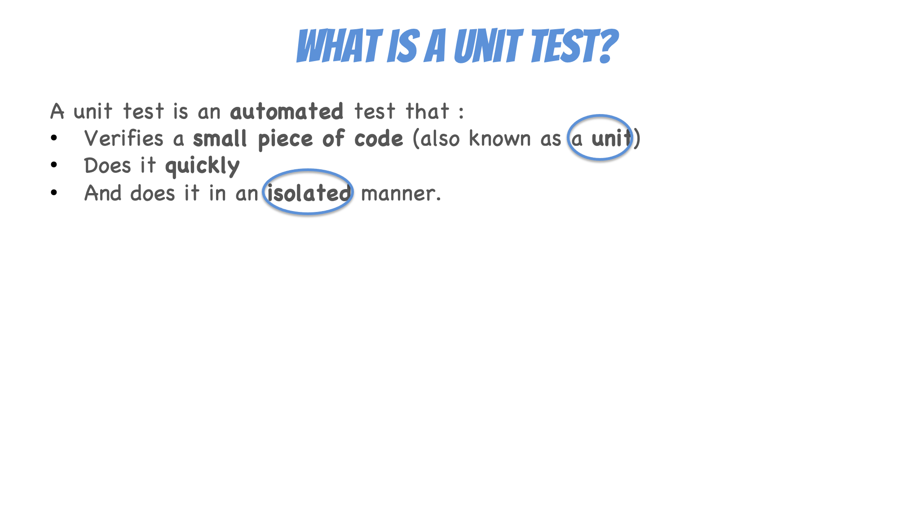
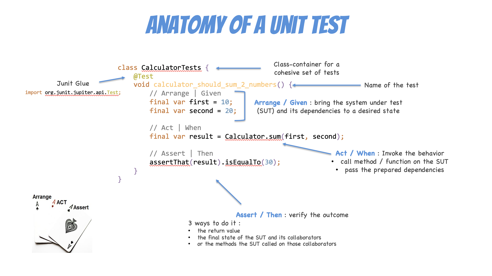

# Intro aux tests automatisés






* Courte explication :
    * But d’un test
    * La [pyramide de tests](https://martinfowler.com/articles/practical-test-pyramid.html)
    * [Quadrant de tests](https://www.all4test.fr/blog-du-testeur/la-methode-agile-et-le-test-logiciel-tous-savoir/)
    * Notion AAA (Arrange–Act–Assert)

[Infographie "Unit Testing Principles, Practices, and Patterns"](files/Unit%20Testing%20Principles%2C%20Practices%2C%20and%20Patterns.pdf)

## Test it or Die Try'in - 60'
- [java](java/how-to.md)
- [php](php/how-to.md)
- [typescript](ts/how-to.md)

* Bonus : faire échouer volontairement un test → ils voient l’intérêt immédiat.

## Code Coverage

Le **code coverage** (couverture de code) mesure le pourcentage de code de production exercé par les tests automatisés. Il révèle les chemins non testés — mais pas la qualité des tests.

> Un coverage de 100 % ne garantit pas l'absence de bugs. Il garantit seulement que chaque ligne a été exécutée au moins une fois.

### Métriques courantes

| Métrique | Description |
|---|---|
| **Line / Statement** | % de lignes exécutées |
| **Branch** | % de branches (if / else / switch) couvertes |

### Lancer le coverage
#### Java — JaCoCo via Maven

JaCoCo s'exécute automatiquement pendant `mvn test` grâce au plugin déjà configuré dans le `pom.xml`.

```bash
cd solutions/java
mvn test
# Rapport HTML → target/site/jacoco/index.html
```

#### PHP — PHPUnit avec Xdebug ou pcov

PHPUnit délègue la collecte au driver PHP installé sur la machine.

```bash
cd solutions/php
composer install

# Avec Xdebug
XDEBUG_MODE=coverage vendor/bin/phpunit

# Rapport HTML → coverage-report/index.html
# Résumé affiché directement dans le terminal
```

#### TypeScript — Vitest + v8

Le provider `v8` est natif Node.js, aucun outil supplémentaire n'est requis.

```bash
cd solutions/ts
npm install
npm run coverage
# Rapport HTML → coverage-report/index.html
# Résumé affiché directement dans le terminal
```

